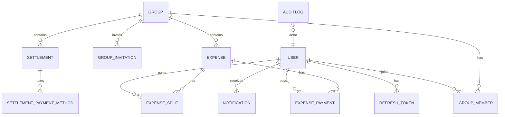

## Database ER Diagram

Entities and relationships for Money Split application.

Key design notes:
- All monetary fields stored as minor units (`Int`/`bigint`) to avoid floating point errors.
- Financial records (expenses, payments, settlements) are immutable in history; do not hard-delete settled records.
- Soft deletes used for invitations and notifications.
- Indexes added on `groupId`, `userId`, `expenseId`, and `createdAt` for query performance.
