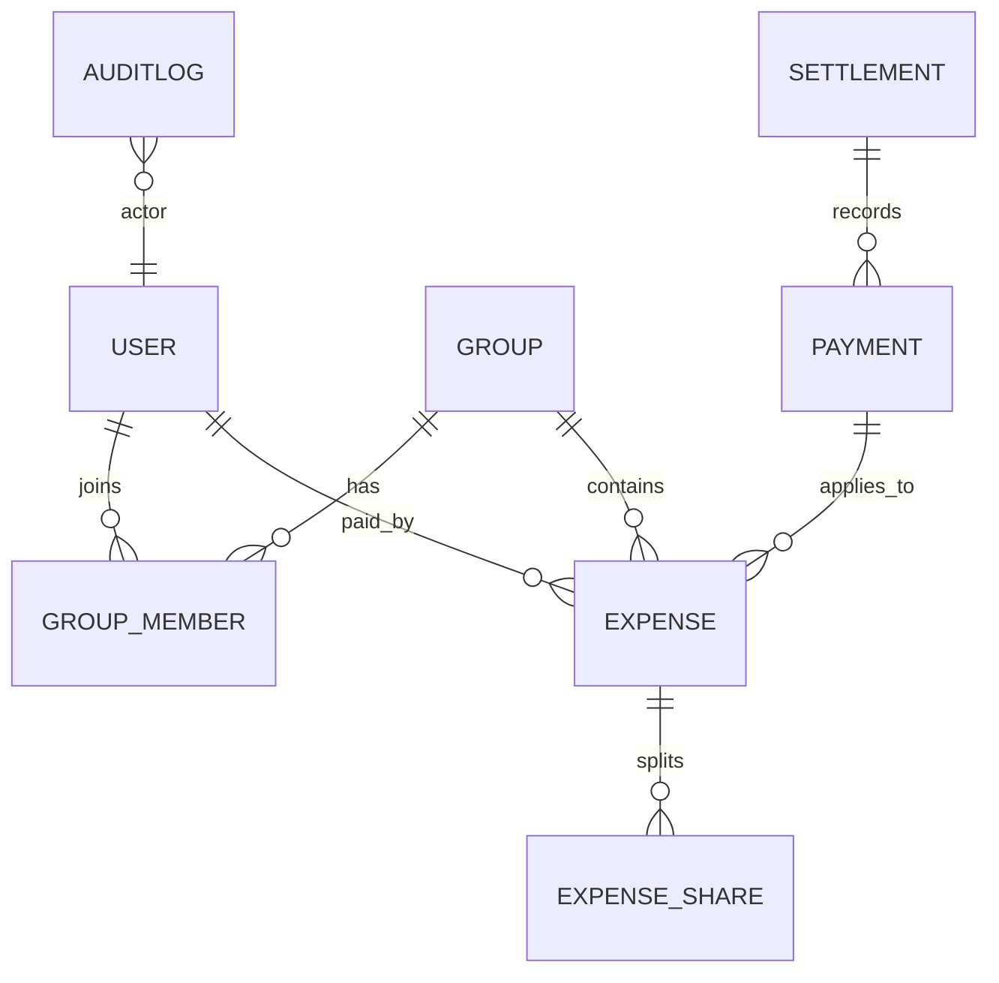

## Database ER Diagram

Entities: User, Group, GroupMember, Expense, ExpenseShare, Payment, Settlement, AuditLog

Financial rules: amounts stored as minor units (integer) or decimal; immutable audit logs.
